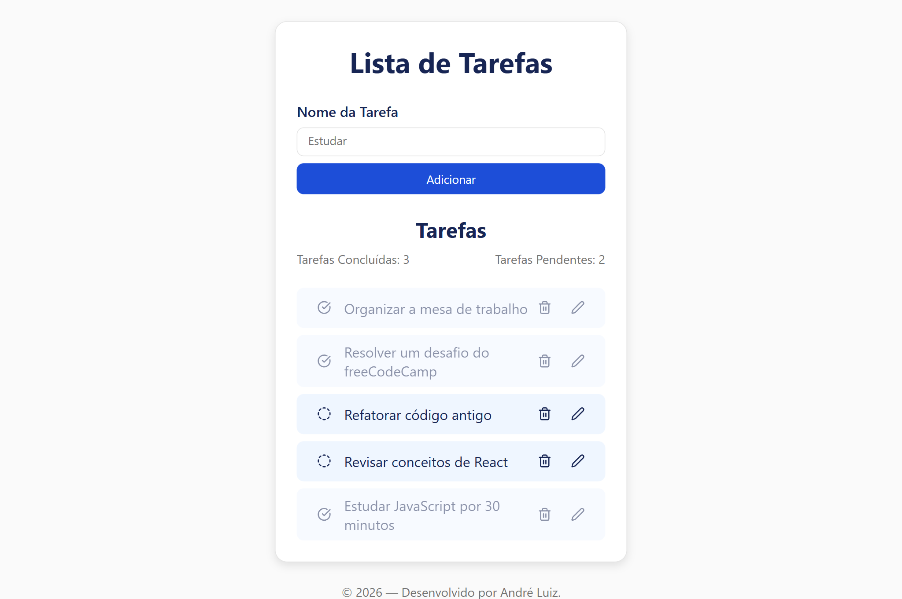
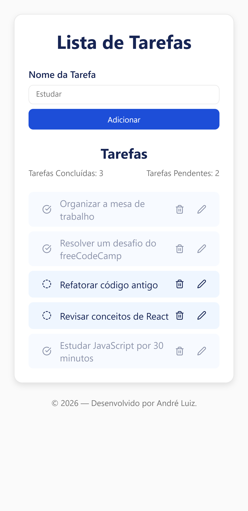

# ✅ To-Do List

Aplicação de lista de tarefas desenvolvida com **React + TypeScript**, permitindo criar, editar, concluir e remover tarefas, com salvamento dos dados no **Local Storage**.

Projeto online: https://to-do-list-ochre-psi.vercel.app/

---

## 🖼️ Preview do Projeto

🖥️ Desktop



📱 Mobile



---

## 🚀 Funcionalidades

-   ➕ Adicionar novas tarefas
-   ✏️ Editar tarefas existentes
-   ✅ Marcar tarefas como concluídas
-   ❌ Remover tarefas
-   📊 Contador de tarefas concluídas e pendentes
-   💾 Salvamento de dados com Local Storage
-   📱 Interface simples e responsiva

---

## 🧠 O que eu aprendi com esse projeto

Durante o desenvolvimento desse projeto, pude aprender e praticar:

-   Uso de **React Hooks** (`useState`, `useEffect`)
-   Criação e tipagem de estados com **TypeScript**
-   Componentização e reutilização de componentes
-   Comunicação entre componentes via **props**
-   Manipulação de listas (CRUD)
-   Salvamento de dados utilizando **Local Storage**
-   Controle de formulários (inputs controlados)
-   Criação de componentes reutilizáveis (Button, Input, Card, etc.)

---

## 🛠️ Tecnologias utilizadas

-   React
-   TypeScript
-   Vite
-   CSS Modules
-   Lucide React (ícones)
-   Local Storage

---

## ▶️ Como rodar o projeto localmente

### Passo a passo

1. Clone o repositório:

```bash
git clone https://github.com/andreluizpo/to-do-list.git
```

2. Acesse a pasta do projeto:

```bash
cd to-do-list
```

3. Instale as dependências:

```bash
npm install
```

4. Inicie o servidor de desenvolvimento:

```bash
npm run dev
```

4. Acesse no navegador:

```
http://localhost:5173
```

---

## 👨‍💻 Autor

Desenvolvido por André Luiz

-   LinkedIn - https://www.linkedin.com/in/andreluizpereiradeoliveira
-   GitHub - https://github.com/andreluizpo
